<h1 align="center">Hi, I'm Jannik</h1>
<h3 align="center">Aspiring Application Developer | Java & Databases | Custom Mechanical Keyboards</h3>

  

---

### About Me

After training as a 3D & Visual Effects Artist and spending a decade in hospitality, I'm now turning that experience into a new career in software development.

- Trained 3D & Visual Effects Artist, skilled in Autodesk Maya and Blender
- Currently in a retraining program (Umschulung) to become an application developer (Fachinformatiker Anwendungsentwicklung) at GFN in Heidelberg
- Learning Java, HTML, CSS, and Python, plus a growing familiarity with C picked up through QMK and my J80-3000 builds
- Next build: turning a G80-3000 wireless with ZMK and an nRF52840 microcontroller
- Based near Heidelberg, Germany
- Always happy to help if you need a keyboard built, fixed, or just want advice, feel free to reach out
- Past builds are on my keyboard portfolio: [J-Keebs](https://brotbeutel.github.io/04_keyboards.html)

---

### Projects

**[QMK Firmware Fork](https://github.com/Brotbeutel/qmk_firmware)**
Home to my two most involved keyboard builds, J80-3000 I2C and J80-3000 SPI, both based on a Cherry G80-3000 with the original controller replaced by a Blackpill microcontroller and the GPIO count extended via an MCP23017 (I2C) or MCP23S17 (SPI) expander. My most demanding project so far.

**[j80_3000_documentation](https://github.com/Brotbeutel/j80_3000_documentation)**
Supporting documentation for both G80-3000 builds: datasheets, pinouts, and build notes.

**[Kundenverwaltung](https://github.com/Brotbeutel/Kundenverwaltung)**
A customer management web app (Flask, SQLAlchemy, SQLite) with employee login, role management, and GDPR-compliant deletion. Built as a group project with two classmates during the retraining program.

**[Brotbeutel.github.io](https://github.com/Brotbeutel/Brotbeutel.github.io)**
My J-Keebs website, currently under construction. I present my keyboard portfolio there and write about mechanical keyboards while practicing my HTML and CSS skills.

---

### Tech Stack

  
  
  
  
  
  
  
  

---

### GitHub Stats

  
  

---

### Contact

  
  
  

<i>Ask me about mechanical keyboards, I'm happy to talk about it.</i>

